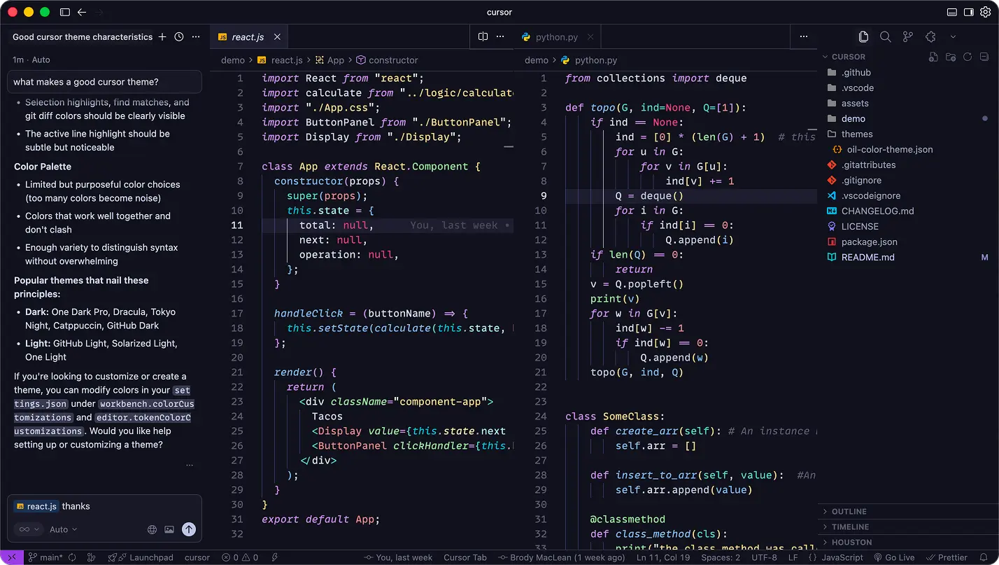

<h1 align="center" style="color: #8D40DD;">
   
  
   
  <a href="#">Oil ∙ VS-Code / Cursor Theme</a>
   
   
</h1>

<h3 align="center">
    ∙ &nbsp;
    <a href="https://github.com/brody/oil-visual-studio-code/issues">Report Bug</a> &nbsp;
    ∙ &nbsp;
    <a href="https://github.com/brody/oil-visual-studio-code/discussions">Discuss</a> &nbsp;
    ∙ &nbsp;
    <a href="https://github.com/brody/oil-visual-studio-code/issues">Request Feature</a> &nbsp;
    ∙ &nbsp;
</h3>
<h3 align="center">
    ∙ &nbsp;
    <a href="https://github.com/brody/oil-visual-studio-code/blob/main/CONTRIBUTING.md">Open Source</a> &nbsp;
    ∙

</h3>
 

